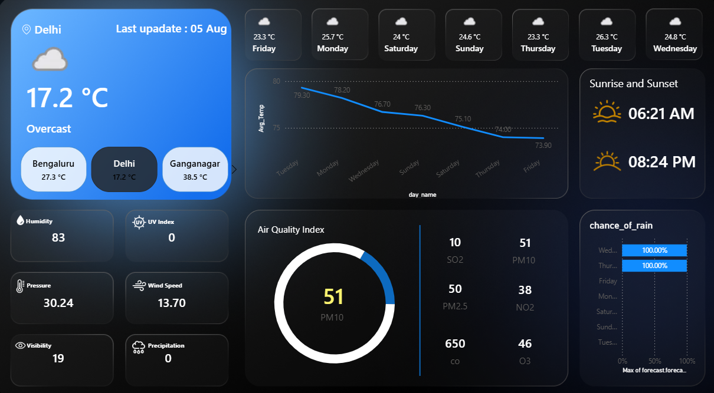

# Weather analysies — Power BI Weather Dashboard

##  Overview
Weather Report1 is a **Power BI** solution that connects to a live weather API, processes raw JSON data, and delivers an interactive dashboard for **current conditions**, **hourly forecasts**, and **daily forecasts**.  
The project showcases **ETL with Power Query (M)**, **data modeling**, and **DAX measures** to produce actionable insights for multiple cities.

---
## 📊 Dashboard Preview
  

### Main Dashboard


---

##  Features
- **Live Weather Data** — Current temperature, humidity, wind speed, and condition cards for each city.
- **Forecast Analysis** — Hourly and daily trends with averages, highs, and lows.
- **City Comparisons** — Map and ranking visuals to compare weather patterns across locations.
- **KPIs & Metrics** — Rolling averages, % rainy days, precipitation totals, and more.
- **Reusable Data Model** — Dimension tables for City and Date ensure consistent filtering and relationships.

---

## 🛠 Technology Stack
- **Power BI Desktop** — Report creation & modeling (`.pbix` file)
- **Power Query (M)** — API integration & transformation logic
- **DAX** — Measures, calculated columns, and time intelligence
- **Git & GitHub** — Version control & documentation
- *(Optional)* **Python** — For extended preprocessing or custom CSV extracts

---

##  Data Flow
1. **Extract** — API calls for a configurable list of cities (parameterized in Power Query).
2. **Transform** — JSON parsing into:
   - `Current`
   - `Forecast_Hour`
   - `Forecast_Day`
   Clean column names, set data types, create keys.
3. **Load** — Tables loaded into Power BI model with City and Date dimensions.
4. **Visualize** — Dashboards with slicers, trend lines, KPIs, and comparative views.

---

##  Example DAX Measures
```DAX
Avg Temperature = AVERAGE(Forecast_Day[avgtemp_c])

Rainy Days % = 
DIVIDE(
    COUNTROWS(FILTER(Forecast_Day, Forecast_Day[Condition] = "Rain")),
    COUNTROWS(Forecast_Day)
)

Max Temp = MAX(Forecast_Day[maxtemp_c])
